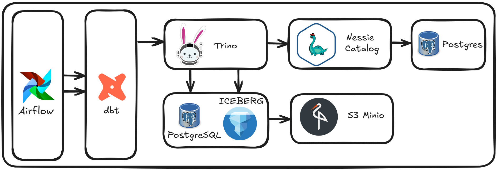
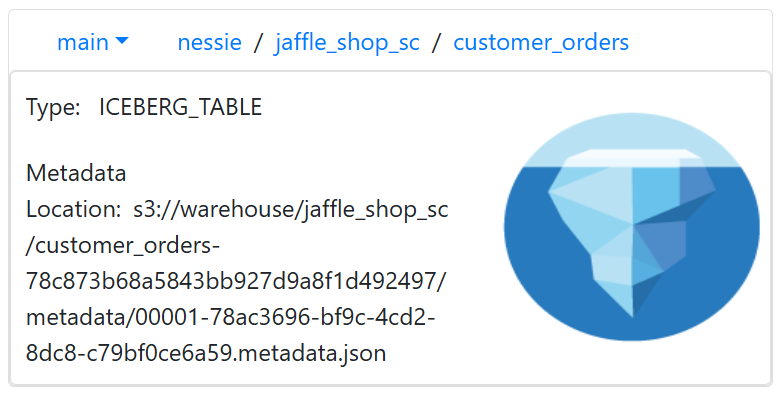
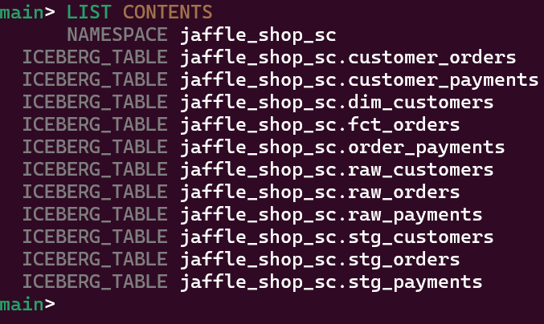
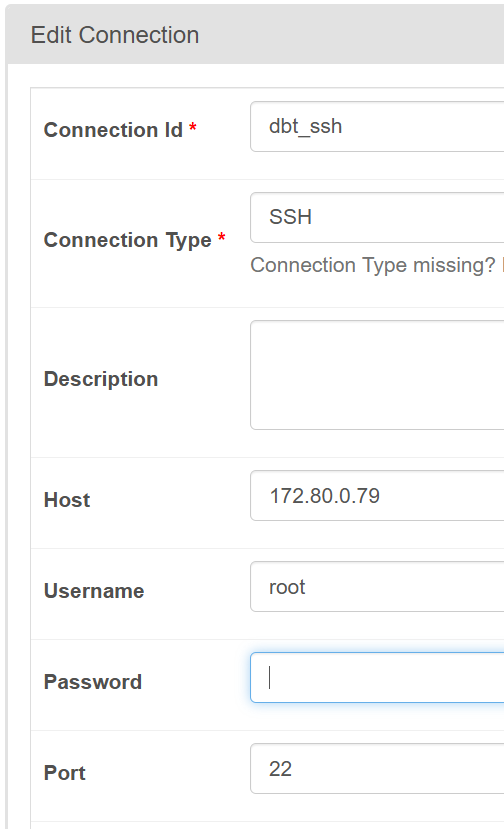
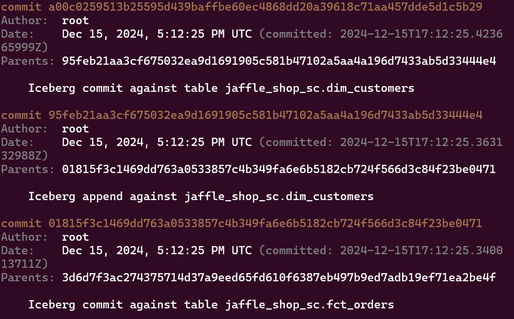
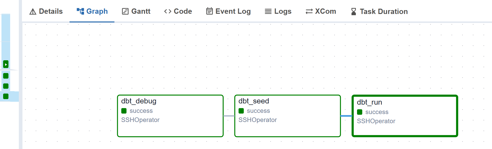

# Seamless Data Integration with Iceberg and Nessie Catalog using Airflow

This project aims to develop a data pipeline that seamlessly integrates ETL processes with relevant databases using Trino. The pipeline is orchestrated by Airflow, which triggers dbt to manage the data transformations. The architecture incorporates, S3 MinIO for Iceberg storage and PostgreSQL for database operations. The workflow includes seeding raw data into Nessie-Catalog-Iceberg and PostgreSQL using the dbt seed command to load CSV files. Once debuging, dbt is used to seed, run, and fully transform the data.




## Table of Contents
- [In this project](#In-this-project)
- [System and Software Versions](#system-and-software-versions)
- [Setup](#setup)
- [Important Information](#important-information)
  - [📚 Trino - iceberg.properties configuration and Cost Optimization](#1-trino---icebergproperties-configuration-and-cost-optimization)
  - [📚 Nessie Catalog Setup](#2-nessie-catalog-setup)
  - [📚 DBT Deploy The Project](#3-dbt-deploy-the-project)
  - [📚 Airflow and DBT SSH Connection and Run The Dag](#4-airflow-and-dbt-ssh-connection-and-run-the-dag)
- [Deep Notes](#deep-notes)
- [References](#references)


## In this project:
1. Installing dbt and Creating a Data Pipeline:
  - Step-by-step guide to installing `dbt`.
  - Setting up a data pipeline for transformations and seeding raw data into `Nessie-Catalog-Iceberg-Format` and `PostgreSQL`. 
  - Added partition and iceberg configuration each taable for Cost Optimization.
2. Installing Trino:
  - Instructions for installing Trino on various platforms.
  - Setting up the environment and prerequisites.
  - Added partition and iceberg configuration `jaffle_shop_iceberg.properties` file for Cost Optimization.
3. Deploying Trino Configuration and Properties Files:
  - Deploying Trino configuration files for connecting to:
    - Nessie Catalog and Iceberg.
    - PostgreSQL for database operations.
4. Configuring Trino for Iceberg with MinIO:
  - Configuring Trino to use Iceberg as the table format.
  - Setting up MinIO as the storage backend for Iceberg tables.
5. Installing Nessie Catalog and Configuration:
  - Steps to install Nessie Catalog.
  - Detailed instructions for configuring necessary files to integrate `Nessie Catalog` with `Trino`.
6. Using Nessie-CLI:
  - Guide to installing and using `Nessie-CLI`.
  - Verifying the `Git-like` features of `Nessie Catalog` for versioning and branch management.
7. Installing Airflow and Setting up SSH Connections:
  - How to install and configure Airflow for task orchestration.
  - Configuring SSH connections for seamless interaction with `dbt` and `Trino`.
8. Creating a Dockerized Deployment:
  - Building and deploying the entire project with Docker.
  - Writing a Dockerfile to create platform-agnostic containers deployable on any VM or cloud instance.
9. Following Dockerfile 's and deploying any enviorement:
  - All necessary files and links belog to the in Dockerfile and starter.sh.


## System and Software Versions

| **Component**           | **Version**              | **Description**                                                                 |
|--------------------------|--------------------------|---------------------------------------------------------------------------------|
| **WSL**                 | Ubuntu-24.04 (Distro 2)  | Windows Subsystem for Linux, used as the base operating system for the setup.  |
| **Docker**              | Docker Desktop 4.36.0    | Containerization platform to run and manage all components.                    |
| **Docker Compose**      | v2.30.3                  | Tool for defining and running multi-container Docker applications.             |
| **Postgres**            | 17              | Database used for storing structured data in the pipeline.                     |
| **Trino**               | 457                | Distributed SQL query engine for data querying and analysis.                   |
| **Iceberg**             | 1.6.1            | Table format for managing large-scale data on MinIO.                           |
| **Airflow**             | 2.10.2                   | Workflow orchestration tool for scheduling and automating tasks.               |
| **Nessie-Server**       | 0.76.6                   | Git-like catalog for version control of data lakes.                            |
| **Nessie-CLI**          | 0.101.2                  | Command-line interface to interact with Nessie Server.                         |
| **DBT**                 | 1.9.0                    | Data transformation tool for managing ELT workflows.                           |
| **DBT-Trino-Plugin**    | 1.8.5                    | Plugin to enable `dbt` to work with Trino.                                      |


**P.S.**: All versions are included in the `.env` file. You can update to the latest versions, but ensure that all tools remain compatible with each other.

## Setup
### 🛠️ Git Clone (Easy Setup)

1. Clone The Repository:
```bash
git clone https://github.com/mcagriaktas/dbt-iceberg-nessie-catalog.git
```

2. Create Docker Network:
```bash
docker network create --subnet=172.80.0.0/16 dahbest
```

**P.S.**: If you want to use your own Docker network, make sure to update the `docker-compose.yml` file to reflect the network changes.

3. Build The Artitecture:
```bash
cd dbt-iceberg-nessie-catalog

docker-compose up -d --build
```

**P.S.**: Wait for 1 minute for the architecture to start, then check the logs to ensure all containers have started successfully and are in a healthy state.

```bash
docker ps -a

docker logs container_name
```

4. Software's Ports and User Information:

| **Component**     | **IP-Host**    | **Port** | **User Information**                 |
|--------------------|---------------|----------|--------------------------------------|
| **Postgres**       | 172.80.0.10   | 5432     | User = Cagri, Password = 3541        |
| **Trino**          | 172.80.0.80   | 8080     | User = Cagri                         |
| **Airflow**        | 172.80.0.11   | 9090     | User = Cagri, Password = 3541        |
| **Nessie-Server**  | 172.80.0.12   | 19120    | -                                    |
| **DBT**            | 172.80.0.79   | 22       | -                                    |
| **MinIO-S3**       | 172.80.0.13   | 9000     | User = Cagri, Password = 35413541 & AWS_ACCESS_KEY = cagri, AWS_SECRET_KEY = 35413541    |


## Important Information

### 1. Trino - iceberg.properties configuration and Cost Optimization:

Firstly, need to configure our DBT SQL query with the Iceberg format and partition in `dbt/project/models/*.sql`:
```bash
{{ config(
    materialized='table',         # << This is for our dbt table. 
    format='iceberg',             # << This is for iceberg table.
    partition_by=['first_order']  # << This is our partition, check Deep Notes  
) }}
```
[Deep Note: 1](#1)

⚠️ After configuring our `*.sql` query, need to set up our `iceberg.properties`:
```bash
connector.name=iceberg                                                    
iceberg.catalog.type=nessie
iceberg.nessie-catalog.uri=http://172.80.0.12:19120/api/v2
iceberg.file-format=PARQUET
iceberg.query-partition-filter-required-schemas=jaffle_shop_sc
iceberg.nessie-catalog.ref=main
iceberg.nessie-catalog.default-warehouse-dir=s3://warehouse
```
[Deep Note: 1.1](#1.1)

After setting the configuration, it can view the Iceberg partition path in the Nessie catalog:
```bash
http://localhost:19120/content/main/jaffle_shop_sc/raw_customers
```



You can also confirm it using the `Nessie-CLI`:
```bash
docker exec -it nessie bash

java -jar $NESSIE_HOME/nessie-cli.jar -u http://localhost:19120/api/v2

main> LIST CONTENTS
```



**P.S**: If you want to change the branch, you can do it like this:

```bash
main> CREATE BRANCH jaffle_shop
```

Then set the branch name in Trino `iceberg.properties`:
```bash
iceberg.nessie-catalog.ref=main # main is default branch.
```

Lastly, you can type `HELP` in the `Nessie-CLI` to display all available options. For more details, refer to the official documentation: `https://projectnessie.org/nessie-0-96-0/cli/`
Additionally, I have included a `Nessie-Command.md` file with some commonly used commands.


### 2. Nessie Catalog Setup:
The Nessie catalog requires a `.yml` file for configuration. For this reason, an `application.yml` file has been set up at `nessie/config/application.yml`.
```bash
quarkus:
  datasource:
    db-kind: postgresql
    username: cagri
    password: 3541
    jdbc:
      url: jdbc:postgresql://postgres:5432/nessie_db?currentSchema=nessie 

nessie:
  version: 2
  server:
    port: 19120
    server-api-version: 2
  version-store-type: JDBC
  reference:
    default-name: main
```
[Deep Note: 2](#2)

⚠️ The `application.yml` file is stored in the `opt/nessie/config` path. For this reason, Nessie needs to be run as follows:

```bash
java -Dquarkus.config.file=$NESSIE_HOME/config/application.yaml -jar $NESSIE_HOME/nessie-server.jar
```


### 3. DBT Deploy The Project:
First, check the official documentation for the `Jaffle Shop project` and `DBT-core`:
`https://github.com/dbt-labs/jaffle-shop-classic`

**P.S.**: There's no need to deploy any `DBT project`. Instead, check the `dbt/project` and `dbt/profiles` directories:
```bash
dbt init [project_name] 
```
[Deep Note: 3](#3)

⚠️ All `*.sql` queries in the `dbt/project/models` directory, as well as `raw_data` in the `seed folder`, can have their model run configurations modified in the `dbt_project.yml` file.

### 4. Airflow and DBT SSH Connection and Run The Dag:
Once all necessary files are set, Airflow will automatically configure the `DBT connection`.
```bash 
http://localhost:9090/connection/list/ 
```

 

Check the DAGs in `airflow/dags/dbt_etl.py`. 

[Deep Note: 4](#4)

`Example of using SSHOperator and DBT Seed`:
```bash
# Seed task
dbt_seed = SSHOperator(
    task_id='dbt_seed',
    command='cd /dbt && dbt seed --profiles-dir /dbt/profiles --project-dir /dbt/project',
    ssh_conn_id='dbt_ssh',
    dag=dag  
)
```

When the `dbt_etl.py` DAG runs, check the `Nessie-CLI`:

 

In the final output from the Airflow web server:




## Deep Notes:
### [1] 

`partition_by=['first_order']`: 
```
  - Iceberg's indexing is built into the table metadata
  - It's different from traditional database indexes
  - Partition columns get automatic indexing
  - Index maintenance is handled by Iceberg
  - Don't over-index - it increases write time
  - Focus on columns used in WHERE clauses
```


### [1.1] 

`iceberg.query-partition-filter-required-schemas=jaffle_shop_sc`:
```
  - When setting up partitioned tables, we need to create the Iceberg schema. Check the trino/init/post-init.sql file. 
```


### [2]

`url: jdbc:postgresql://postgres:5432/nessie_db?currentSchema=nessie`:
```
  - When the PostgreSQL server (container) is up, the jaffle_shop.sql query automatically creates a database and schema for the Nessie catalog. The database stores the Git-like data for Nessie.
```


### [3]

`dbt init [project_name]`:
```
  - The project and profile are already set up, so there's no need to deploy a new project. However, if needed, refer to the official documentation and ensure that all *.sql files include the following parameters:
  {{ config(
    materialized='table',   
    format='iceberg',           
    partition_by=['first_order'] 
  ) }}
```


### [4]

`Check the dags in the airflow/dags/dbt_etl.py`:
```
  - Normally, the Airflow-DBT operator can be used, but in this architecture, with different servers (containers), the DBT command is executed using the Bash operator.
```


## References

- [Trino — Nessie Catalog](https://projectnessie.org/iceberg/trino/)
- [Trino — Postgres connector](https://trino.io/docs/current/connector/postgresql.html)
- [Trino — DBT connector](https://docs.getdbt.com/docs/core/connect-data-platform/trino-setup)
- [Nessie — Postgres Connection](https://projectnessie.org/nessie-latest/configuration/)
- [DBT — Jaffle Shop Demo](https://github.com/dbt-labs/jaffle-shop-classic)
